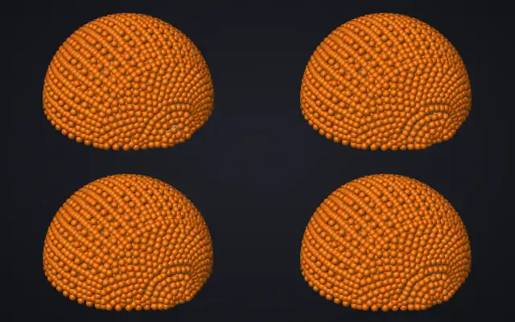

# Latent Space Reinforcement Learning for Inverse Material Estimation in Food Fracture Simulation

[Adrian Ramlal](https://adrian-ramlal.github.io/), [Yuhao Chen](https://yhc-1.github.io/yuhao-chen/) and [John S. Zelek](https://uwaterloo.ca/systems-design-engineering/profile/jzelek), University of Waterloo

CVPR 2026 MetaFood Workshop

[Project page](https://adrian-ramlal.github.io/Inverse-Material-RL/) | [Paper](https://openaccess.thecvf.com/content/CVPR2026W/MTF/papers/Ramlal_Latent_Space_Reinforcement_Learning_for_Inverse_Material_Estimation_in_Food_CVPRW_2026_paper.pdf) | [arXiv](https://arxiv.org/abs/2606.16870)



*Four of the 2,000 training simulations of orange peeling in AnisoMPM, played in sync. Only the 9 material parameters differ.*

The paper estimates the material parameters of a simulated orange from a target description of how it peels. The fracture simulator is not differentiable, so a neural surrogate trained on 2,000 simulations scores each estimate. A goal-conditioned PPO policy acts in the latent space of a normalizing flow and gives an estimate for a new target in one forward pass. On 10 held-out targets, and without per-target retraining, it reaches 82% of the recovery of evolutionary search (CMA-ES) with 625× fewer evaluations.

## Abstract

Realistic visual simulation of food manipulation requires accurate material parameters, yet these are difficult to measure directly and vary across the heterogeneous regions of a single food item. We address the inverse problem of estimating material parameters from a target description of fracture behavior in a non-differentiable continuum damage mechanics simulator. Using orange peeling as a test case, we train a neural surrogate on 2,000 forward simulations and compare Covariance Matrix Adaptation Evolution Strategy (CMA-ES, a gradient-free evolutionary optimizer) with Proximal Policy Optimization (PPO, a reinforcement learning algorithm) across the original 9-dimensional parameter space and two learned 4-dimensional latent representations. Since different oranges have different material properties, a practical inverse system must handle arbitrary targets without retraining. We train a goal-conditioned PPO policy that learns a general inverse mapping: given any target description of peeling behavior, the policy produces a material parameter estimate in a single forward pass (8 surrogate evaluations, approximately 10 ms). Operating in a normalizing flow latent space with a shared surrogate evaluator, the goal-conditioned policy achieves 0.642 actual recovery when validated through the simulator, outperforming the original parameter space by 23%. A warm-start extension that initializes CMA-ES refinement from the policy's output further improves recovery to 0.828 with 540 evaluations. These findings provide a practical framework for inverse food physics and lay groundwork for vision-driven material identification from video observations of food manipulation.

## Citation

```bibtex
@InProceedings{ramlal2026latent,
    author    = {Ramlal, Adrian and Chen, Yuhao and Zelek, John S.},
    title     = {Latent Space Reinforcement Learning for Inverse Material Estimation in Food Fracture Simulation},
    booktitle = {Proceedings of the IEEE/CVF Conference on Computer Vision and Pattern Recognition (CVPR) Workshops},
    month     = {June},
    year      = {2026},
    pages     = {9573-9581}
}
```

## About this repository

This repository holds the source of the project page. It is plain HTML adapted from the [Nerfies](https://github.com/nerfies/nerfies.github.io) template and served by GitHub Pages. To preview it locally, run `python3 -m http.server` in this folder and open http://localhost:8000.

Like the template, the page is licensed under [CC BY-SA 4.0](https://creativecommons.org/licenses/by-sa/4.0/).
